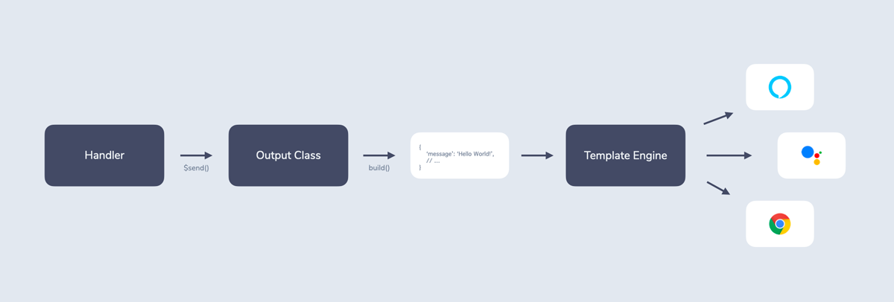

# Output

- [Introduction](#introduction)
- [Output Class](#output-class)
  - [Build Method](#build-method)
  - [Output Options](#output-options)
  - [Helper Methods](#helper-methods)
- [Output Template](#output-template)

## Introduction



A big part of building a Jovo app is returnig output to the user. This output could include all sorts of things, speech (for voice interfaces) or text (for visual interfaces) messages being the most prominent.

Jovo has its own multimodal template engine that takes structured output and translates it into a native platform response. The output is managed in the form of [output classes](#output-class) that are returned by [handlers](./handlers.md) using the `$send` method.

Here is an example how this works with an output class called `YourOutput`:

```typescript
import { YourOutput } from './output/YourOutput';

// ...

someHandler() {

  // ...

  return this.$send(YourOutput);
}
```

The most important part of an output class is an [output template](#output-template) that is returned by a [`build` method](#build-method). This object is then translated into the appropriate platform response.

```typescript
build() {
  return {
    message: 'Hello World!',
  };
}
```

One of the benefits of using these classes is that there is a clear separation between handler logic and output content. The convention is that the handler collects all the necessary data (for example by doing API calls) and then passes it to the output class as [options](#output-options).

Here is an example how this could look like for a restaurant system that wants to list its menu categories. It does an API call to retrieve `categories` and then passes them to the `ShowCategoriesOutput` class:

```typescript
import { ShowCategoriesOutput } from './output/YourOutput';
import { getCategories } from './services/MenuApi';

// ...

async showMenuCategories() {

  const categories = await getCategories();
  return this.$send(ShowCategoriesOutput, { categories });
}
```

The `ShowCategoriesOutput` class then can then list the categories. You can even add [helper methods](#helper-methods) like `listCategories()` to keep the actual `build` method clean:

```typescript
build() {
  return {
    message: `Here are our categories: ${this.listCategories(this.options.categories)}`,
  };
}

listCategories(categories) {
  // ...
}
```


## Output Class

Output classes are stored in a component's `output` folder. As a convention, the files are usually named like the class, for example `MenuOutput.ts`.

Each output class contains:

- A [`build` method](#build-method) that returns an [output template](#output-template)
- [`options`](#output-options) that can be passed using `$send`
- Optionally [helper methods](#helper-methods) that can be used to build the output object

Here is an example of a `HelloWorldOutput` class:

```typescript
import { BaseOutput } from '@jovotech/framework';

export class HelloWorldOutput extends BaseOutput {

  build() {
    return {
      message: 'Hello World!',
    };
  }
}
```


### Build Method

The `build` method is responsible for returning the output object:

```typescript
build() {
  return {
    message: 'Hello World!',
  };
}
```

### Output Options

As a convention, an output template should only be responsible for organizing the output, not collecting any data. To achieve this, the handler should first collect all necessary information and the pass it to the output class as `options`:

```typescript
return this.$send(YourOutput, { /* options */ });
```

These options can then be referenced inside the output class using `this.options`.

For example, here we're passing a user's `name`: 

```typescript
return this.$send(YourOutput, { name: 'Sam' });
```

We can then greet them by their name using `this.options.name`:

```typescript
build() {
  return {
    message: `Hello ${this.options.name}!`,
  };
}
```


### Helper Methods

You can add helper methods to the output class and reference them with `this.helperMethodName()`.

```typescript
build() {
  return {
    message: `Here are our categories: ${this.listCategories(this.options.categories)}`,
  };
}

listCategories(categories) {
  // ...
}
```

## Output Template

// TODO