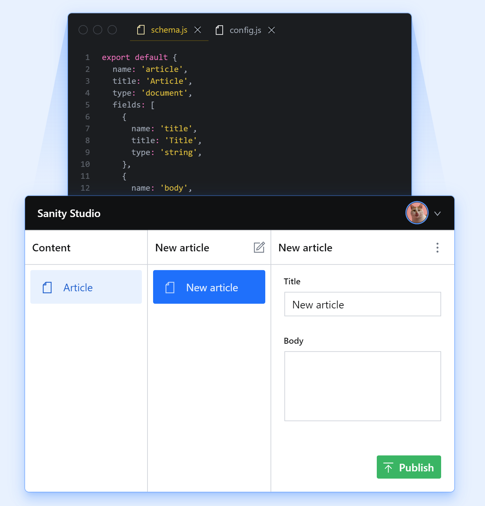
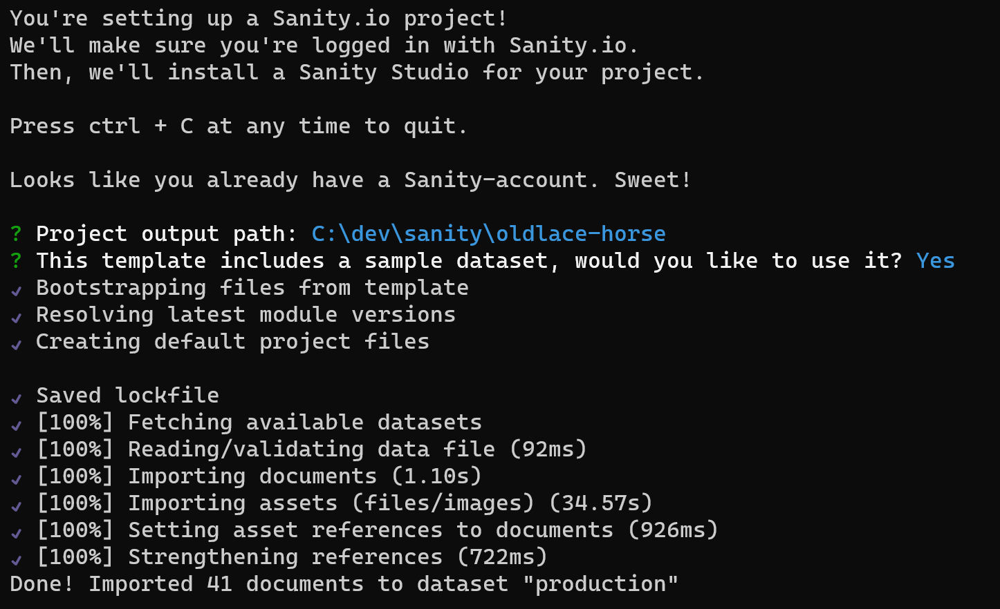
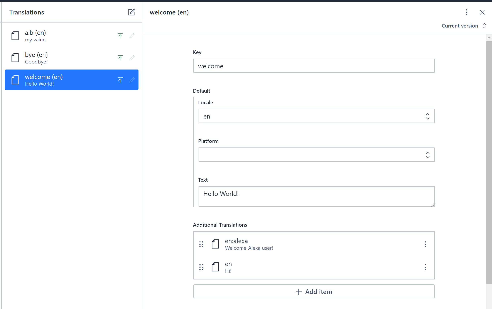

# Sanity CMS Integration

This [CMS integration](https://www.jovo.tech/docs/cms) lets you manage your content in Sanity.

## Introduction

[Sanity](https://www.sanity.io) is a platform for structured content that includes an open source, customizable web editor. With this Sanity integration for Jovo, you can manage all the content of your Jovo app in the Sanity CMS. This makes collaboration easier and enables you to update and add content faster.

Here is a screenshot from Sanity Studio which is used to define schema for different data types, add data for those types, and query to access the data:



It's possible to define your own types (like `Article` in the example above). Using [GROQ (Graph-Relational Object Queries)](https://www.sanity.io/docs/groq) you can create a query to return an array of objects or a single object. GROQ itself allows you to include multiple data types in a single response or change the structure of the resulting JSON.

Learn more about the Sanity Jovo integration in the following sections:

- [Installation](#installation): Set up Sanity and connect it to your Jovo app
- [Configuration](#configuration): All configuration options for this integration
- [Query transformers](#query-transformers): Change the structure of a query result before it is saved in the `$cms` property in Jovo

## Installation

To successfully use Jovo with Sanity, you need to follow the steps detailed in the sections below:

- [Set up Sanity](#set-up-sanity)
- [Add Sanity Integration to Jovo App](#add-sanity-integration-to-jovo-app)

### Set up Sanity

To get started, create a schema and data in Sanity by visiting the [Sanity Studio](https://www.sanity.io/studio) page and clicking the **"Get started"** button. Learn more in the [official Sanity documentation](https://www.sanity.io/docs/overview-introduction).

At the end, you will have a project stored in Sanity and a command to generate an admin website to manage the data:

```sh
# Install Sanity CLI
$ npm install -g @sanity/cli

# Initialize Sanity project
$ sanity init --template getting-started-pets --project <your-project-name> --dataset production --provider google
```

Executing the command in the terminal will set up a web project:



Then use the the following commands to run Sanity Studio:

```sh
# Go to project directory
$ cd <your-project-name>

# Launch Sanity Studio
$ sanity start
```

If you want to use translations for [i18n](https://www.jovo.tech/docs/i18n) (one of the typical use cases for [Jovo CMS integrations](https://www.jovo.tech/docs/cms)), the integration expects the schema in your Sanity Studio project to include both a [`translation.js`](./sanity-studio/translation.js) and a [`translationEntry.js`](./sanity-studio/translationEntry.js) file. Learn more in the [`TranslationsQueryTransformer` section](#translationsquerytransformer).

### Add Sanity Integration to Jovo App

In your Jovo project, install the plugin like this:

```sh
$ npm install @jovotech/cms-sanity
```

Add it as a plugin to your [app configuration](https://www.jovo.tech/docs/app-config), for example `app.ts`:

```typescript
import {
  SanityCms,
  KeyObjectQueryTransformer,
  TranslationsQueryTransformer,
} from '@jovotech/cms-sanity';
// ...

const app = new App({
  plugins: [
    new SanityCms({
      client: {
        projectId: '<YOUR-PROJECT-ID>',
        dataset: '<YOUR-DATASET>',
      },
      queries: {
        translations: new TranslationsQueryTransformer(),
      },
      // ...
    }),
    // ...
  ],
});
```

You need the `projectId` and `dataset` from your Sanity project which can be found in the command line above or going to your Sanity [dashboard](https://manage.sanity.io) and selecting your project.

You will also need at least one query which consists of a key and a [GROQ](https://www.sanity.io/docs/groq) statement. The example adds `translations` for [i18n](https://www.jovo.tech/docs/i18n) (using the [`TranslationsQueryTransformer`](#translationsquerytransformer)), which can be accessed with `this.$t()`. For other data types, take a look at the [`queries` section](#queries).

All configuration options can be found in the [configuration section](#configuration).

## Configuration

The following configurations can be added:

```typescript
new SanityCms({
  client: {
    projectId: '<YOUR-PROJECT-ID>',
    dataset: '<YOUR-DATASET>',
    token: '<YOUR-TOKEN>',
    apiVersion: '2021-03-25',
    useCdn: true,
  },
  queries: {
    translations: new TranslationsQueryTransformer({
      query: "*[_type == 'translation' && !(_id in path('drafts.**'))]",
    }),
    products: new KeyObjectQueryTransformer({
      key: '_id',
      query: "*[_type == 'product' && !(_id in path('drafts.**'))]",
    }),
    articles: "*[_type == 'article' && !(_id in path('drafts.**'))]",
    siteSettings: "*[_type == 'siteSettings' && !(_id in path('drafts.**'))][0]",
  },
}),
```

- `client`: Values used with the [Sanity client library](https://www.sanity.io/docs/js-client#api).
  - [`projectId`](#projectId): Your Sanity project ID.
  - [`dataset`](#dataset): Your Sanity dataset.
  - [`token`](#token): Optional token if you want authenticated access to your data. The default is empty string for unauthenticated access.
  - [`apiVersion`](#apiversion): The version of the API. Uses the current date as default.
  - [`useCdn`](#usecdn): Determines whether to used the Sanity cached API CDN for faster response times. The default is `true`.
- [`queries`](#queries): Define this list of GROQ queries to execute and the key under `$cms` to store the resulting JSON.

### projectId

Identifies your Sanity project.

```typescript
new SanityCms({
  client: {
    projectId: '<YOUR-PROJECT-ID>',
    // ...
  },
}),
```

In a configured studio, you find the project ID in the `sanity.json` file at the root of your project. Otherwise, you can always find it by locating your project on https://manage.sanity.io or running `sanity debug` in the terminal in your studio folder.

### dataset

Identifies the data store within your project. Can be used for `development` or `production`.

```typescript
new SanityCms({
  client: {
    apiVersion: '2021-03-25',
    // ...
  },
}),
```

In a configured studio, you find the dataset in the `sanity.json` file at the root of your project. Otherwise, you can always find it by locating your project on https://manage.sanity.io or running `sanity debug` in the terminal in your studio folder.

### token

A token to secure API calls. Empty string means public access.

```typescript
new SanityCms({
  client: {
    token: '<YOUR-TOKEN>',
    // ...
  },
}),
```

Use https://manage.sanity.io to create an API token. Empty string by default.

### apiVersion

Specifies the version of the API.

```typescript
new SanityCms({
  client: {
    projectId: '<YOUR-PROJECT-ID>',
    // ...
  },
}),
```

Read [API Versioning](https://www.sanity.io/docs/api-versioning) for more details. By default, uses the current date: `new Date().toISOString().split('T')[0]`

### useCdn

Flag to determine if the direct API or the API CDN will be used.

```typescript
new SanityCms({
  client: {
    useCdn: true,
    // ...
  },
}),
```

Setting this to `false` will directly access the most recent values in the Sanity Content Lake. A `true` value will call the [API CDN](https://www.sanity.io/docs/api-cdn) endpoint to more quickly access cached content.

### queries

Query your Sanity content using [GROQ (Graph-Relational Object Queries)](https://www.sanity.io/docs/groq). In this section, define one or more queries and the key that will be used to access the result using Jovo `this.$cms.<key>`:

```typescript
new SanityCms({
  queries: {
    translations: new TranslationsQueryTransformer({
      query: "*[_type == 'translation' && !(_id in path('drafts.**'))]",
    }),
    products: new KeyObjectQueryTransformer({
      key: '_id',
      query: "*[_type == 'product' && !(_id in path('drafts.**'))]",
    }),
    articles: "*[_type == 'article' && !(_id in path('drafts.**'))]",
    siteSettings: "*[_type == 'siteSettings' && !(_id in path('drafts.**'))][0]",
  },
}),
```

In this example:

- `translations` - an array of all published translations that is then transformed by [`TranslationsQueryTransformer`](#translationsquerytransformer). These translations are available to the [i18n integration](https://www.jovo.tech/docs/i18n) with `this.$t()` or `this.$cms.translations`.
- `products` - an array of all published products that is then transformed by [`KeyObjectQueryTransformer`](#keyobjectquerytransformer) into an object where each item has a key set to the value of `_id` and the value is the object that was the array item. Access with `this.$cms.products`.
- `articles` - an array of all published items of type `article` can be accessed with `this.$cms.articles`. For all published and draft articles, use `"*[_type == 'article']"`
- `siteSettings` - a object for the single `siteSettings` type. Access with `this.$cms.siteSettings`.

Information on query transformers can be found in the [query transformers section](#query-transformers).

## Query Transformers

The Jovo Sanity integration comes with the following query transformers:

- [`TranslationsQueryTransformer`](#translationsquerytransformer)
- [`KeyObjectQueryTransformer`](#keyobjectquerytransformer)

You can also learn more about creating your own [custom query transformers](#custom-query-transformers).

### TranslationsQueryTransformer

This query transformer type makes use of the Jovo [i18n](https://www.jovo.tech/docs/i18n) and allows you to store translation strings in Sanity. By default, it uses the `query` below:

```typescript
import { SanityCms, TranslationsQueryTransformer } from '@jovotech/cms-sanity';
// ...

new SanityCms({
  queries: {
    translations: new TranslationsQueryTransformer({
      query: "*[_type == 'translation' && !(_id in path('drafts.**'))]", // default
    }),
  },
  // ...
}),
```

If you use the `TranslationsQueryTransformer` the integration expects the schema in your Sanity Studio project to include both a [`translation.js`](./sanity-studio/translation.js) and a [`translationEntry.js`](./sanity-studio/translationEntry.js) file.

This will give you the following screens in Sanity Studio to enter translations:



Each translation entry has:

- Key (required) - ex: `welcome` or `bye`. You can also use dot notation such as `a.b`.
- Locale (required) - such as `en` or `en-US`. Add more locales in Additional Translations.
- Text (required) - the translated text.
- Platform (optional) - used for [platform specific translations](https://www.jovo.tech/docs/i18n#platform-specific-translations) such as `alexa` or `googleAssistant`.

By using this query transformer type, you can access translation strings like this:

```typescript
this.$t('welcome');
```

Jovo automatically returns the right string depending on the current platform. If a platform specific key is empty, the key from its locale (in the example `en`) is used as a fallback.

Here is a sample of how `TranslationsQueryTransformer` transforms the array of `translation` types into an i18n resource:

```json
{
  "en": {
    "translation": {
      "welcome": ["Hello World!", "Hi!"],
      "bye": "Goodbye!",
      "a": {
        "b": ["my value", "another"]
      }
    },
    "alexa": {
      "translation": {
        "welcome": "Welcome Alexa user!"
      }
    }
  }
}
```

### KeyObjectQueryTransformer

This query transformer takes an array result from a GROQ query and transforms it into an object using the value of the `key` property as the key on the object.

```ts
import { SanityCms, KeyObjectQueryTransformer } from '@jovotech/cms-sanity';
// ...

new SanityCms({
  // ...
  queries: {
    products: new KeyObjectQueryTransformer({
      key: '_id',
      query: "*[_type == 'product' && !(_id in path('drafts.**'))]",
    })
  },
}),

```

Here's an example GROQ array result:

```json
[
  {
    "_id": "1990fada-c3c9-4f21-8b02-1618df195900",
    "_type": "product",
    "name": "Sharpie"
    // ...
  },
  {
    "_id": "416c5e3a-194a-404e-81c5-44b8ed1f7aad",
    "_type": "product",
    "name": "Cherries"
    // ...
  }
]
```

Here's an example of the result after it is transformed by the `KeyObjectQueryTransformer` when the `key` property is set to `"_id"`:

```json
{
  "1990fada-c3c9-4f21-8b02-1618df195900": {
    "_id": "1990fada-c3c9-4f21-8b02-1618df195900",
    "_type": "product",
    "name": "Sharpie"
    // ...
  },

  "416c5e3a-194a-404e-81c5-44b8ed1f7aad": {
    "_id": "416c5e3a-194a-404e-81c5-44b8ed1f7aad",
    "_type": "product",
    "name": "Cherries"
    // ...
  }
}
```

Access the data using:

```ts
this.$cms.product['1990fada-c3c9-4f21-8b02-1618df195900'];

// or, the pattern:
this.$cms.property.key;
```

### Custom Query Transformers

If you want to customize how the Sanity integration handles your data, you can build your own query transformer type and use it inside your app configuration.

```typescript
// src/transformers/SampleQueryTransformer.ts

import { Jovo } from '@jovotech/framework';
import { BaseSanityQueryTransformer, SanityQueryTransformerConfig } from '@jovotech/cms-sanity';

export class SampleQueryTransformer extends BaseSanityQueryTransformer {
  getDefaultConfig(): SanityQueryTransformerConfig {
    return {
      query: '',
    };
  }

  execute(values: unknown | unknown[], jovo: Jovo): unknown | unknown[] {
    // Transform input (values) into output (array or object)

    return {};
    // return [];
  }
}
```

The plugin consists of two functions:

- `getDefaultConfig()`: Returns an initial config with default values, which will be merged with the config you pass into the constructor.
- `execute()`: Accepts a JSON array or JSON object, which is the result of a GROQ query, and can return any data you'd like (array or object), which you can then access in your handler with `this.$cms`. The Sanity Integration also passes the Jovo object to use as needed.

You can also extend the base transformer config:

```ts
// src/transformers/SampleQueryTransformer.ts

export interface SampleTransformerConfig extends SanityQueryTransformerConfig {
  myKey: string;
}

export class SampleQueryTransformer extends BaseSanityQueryTransformer<SampleTransformerConfig> {
  getDefaultConfig(): SampleTransformerConfig {
    return {
      query: '',
      myKey: '',
    };
  }
  // ...
}
```
